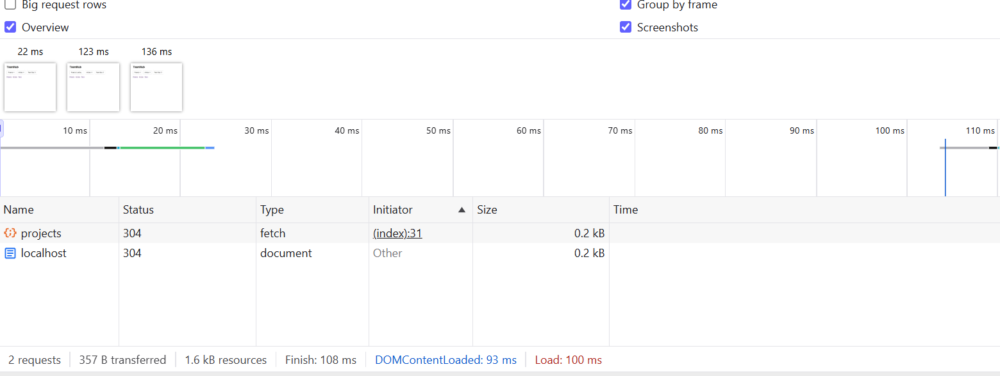

## V1 - Notes 

Network waterfall screenshot showing the document request + the /api/projects fetch

which content is hardcoded HTML and which is fetched
- All except the project-card displaying the project length is hardcoded 